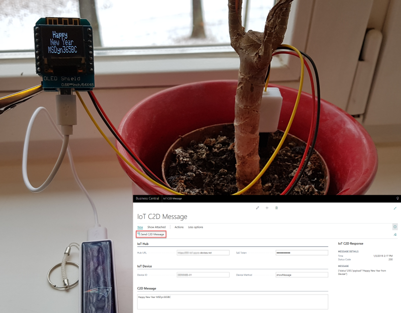
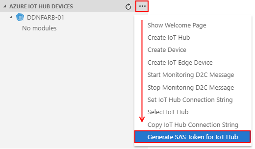
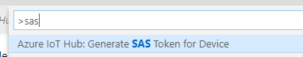
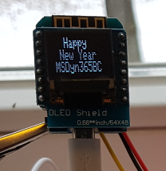

# IoT C2D Messages from Dynamics 365 Business Central

My example invoke an Azure IoT Hub Device Method from Microsoft Dynamics 365 Business Central.



Required information to send a message to from IoT Hub to the IoT Device endpoint are:

* IoT Hub Uri
* IoT Device Id
* [IoT Hub SaS Token](#IoT-Hub-SaS-Token) for authorization

A device method will be invoked by calling the method on the Device Twin by using this Url:

    https://<IoT-Hub-Url>/twins/<DeviceId/methods?api-version=2018-06-30

([API Documentation - Invoke Device Method](https://docs.microsoft.com/de-de/rest/api/iothub/service/invokedevicemethod))

The message content is Json. Key `methodName` specify the called method and `payload` contains the data (parameters) for the method call:

    {
        "methodName": "<Methode-Name>",
        "responseTimeoutInSeconds": 200,
        "payload": {
            "<Param-1>": "...",
            "<Param-2>": 0,
            // ...
        }
    }

## IoT Hub SaS Token

The IoT Hub SaS token can be created by using the [Azure IoT Hub Toolkit](https://marketplace.visualstudio.com/items?itemName=vsciot-vscode.azure-iot-toolkit) VSCode Extension.

Select your IoT Hub and generate the SaS Token for the IoT Hub.


or



## Business Central

The user interface is a `CardpPage` with some fields to enter the needed information. Finally an action `Send C2D Message` will send the message to the specified IoT device.


In the example, C2D messaging is done by a HTTP POST call to the IoT Hub.
And **HttpClient** in Microsoft AL is your friend!

These lines of code from the `Action Trigger` shows, how-to prepare the HttpClient, add the message content and send the message to the IoT Hub:

```js
var
    content: HttpContent;
    client: HttpClient;
    response: HttpResponseMessage;
    uri: Text;
    json: text;
begin
    // Prepare the URL
    uri := StrSubstNo('%1/twins/%2/methods?api-version=2018-06-30', mHubUri, mDeviceId);
    // Add the Authorization Header:
    // 'SharedAccessSignature sr=My-IoT-Hub-Url.azure-devices.net&sig=asdfghjklqwertzuio%2FGASDFDS32Ywcpg%3D&skn=iothubowner&se=2467893962'
    client.DefaultRequestHeaders().Add('Authorization', mAuthorizationToken);

    // Add the message Json
    content.WriteFrom(StrSubstNo('{"methodName":"%1","responseTimeoutInSeconds":200,"payload":{"message":"%2"}}', mMethod, mMessage));

    // Call the IoT Hub
    client.Post(uri, content, response);

    // ...
end;
```

The result `HttpResponseMessage` from the call is presented in a `FactBox` of this page.

    {"status":200,"payload":"Happy New Year from Device!"}

## WeMos D1 mini with Arduino

The device is an ESP8266 WeMos D1 mini shield combined with sensor for soil moisture measure ment and an OLED shield.



My used sketch is based on the [**IoT Hub Feather HUZZAH Client application**](https://github.com/Azure-Samples/iot-hub-feather-huzzah-client-app#iot-hub-feather-huzzah-client-application) example. To show the incoming message from BC, I modified the file `iothubClient.ino` and added a method to display the message, wrapped in the `payload`:

```cpp
const char* showMessage(const unsigned char* payload)
{
    // Display the Message in OLED
    // ...

    return "\"Happy New Year from Device!\"";
}

int deviceMethodCallback(
    const char *methodName,
    const unsigned char *payload,
    size_t size,
    unsigned char **response,
    size_t *response_size,
    void *userContextCallback)
{
    Serial.printf("Try to invoke method %s.\r\n", methodName);
    const char *responseMessage = onSuccess;
    int result = 200;

    if (strcmp(methodName, "showMessage") == 0)
    {
        // ** Handle the incoming message from Business Central **
        responseMessage = showMessage(payload)
    }
    else
    {
        Serial.printf("No method %s found.\r\n", methodName);
        responseMessage = notFound;
        result = 404;
    }

    *response_size = strlen(responseMessage);
    *response = (unsigned char *)malloc(*response_size);
    strncpy((char *)(*response), responseMessage, *response_size);

    return result;
}

```

The received message from BC at the device is:

    {
        "methodName": "showMessage",
        "responseTimeoutInSeconds": 200,
        "payload": {
            "message":"Happy New Year MSDyn365BC"
        }
    }

## Related Information (C2D Messageing)

* [Cloud-to-device communications guidance](https://docs.microsoft.com/en-us/azure/iot-hub/iot-hub-devguide-c2d-guidance)
* [Send cloud-to-device messages from IoT Hub](https://docs.microsoft.com/en-us/azure/iot-hub/iot-hub-devguide-messages-c2d)
* [Understand and use device twins in IoT Hub](https://docs.microsoft.com/en-us/azure/iot-hub/iot-hub-devguide-device-twins)
* [Understand and invoke direct methods from IoT Hub](https://docs.microsoft.com/en-us/azure/iot-hub/iot-hub-devguide-direct-methods)